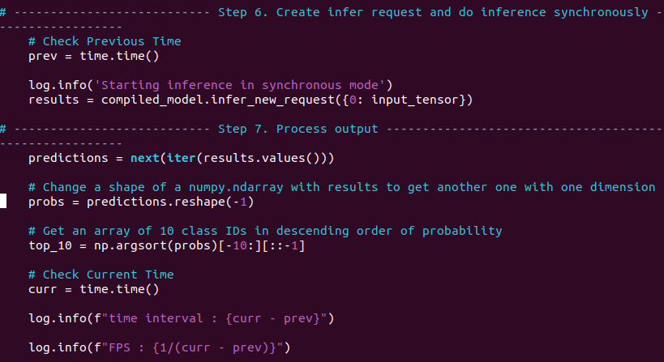

# Homework03
Smart factory 불량 분류모델 training 결과

## Dataset 구조
```
from using following command 
(.otx)$ ds_count ./splitted_dataset 2
./splitted_dataset/: 825
./splitted_dataset/train: 660​
./splitted_dataset/train/pass: 348​
./splitted_dataset/train/fail: 312​
./splitted_dataset/val: 165
./splitted_dataset/val/pass: 87​
./splitted_dataset/val/fail: 78​
```

## Training 결과
|Classification model|Accuracy|FPS|Training time|Batch size|Learning rate|Loss|
|----|----|----|----|----|----|----|
|EfficientNet-V2-S|1.0|48.52|5:07.9393|16|0.00355|nan
|EfficientNet-B0|1.0|126.65|1:14.9771|16|0.00245|0.1057
|DeiT-Tiny|1,0|39.99|2:40.1222|16|0.00005|0.1033|
|MobileNet-V3-large-1x|1.0|150.47|0:55.5312|16|0.0029|0.0615


## FPS 측정 방법
### "hello_classification.py"


### Details
1. Before starting inference, 
I checked time using time module as 'prev'(previous time) at step 6 from inference.py.
```
prev = time.time()
```

2. And after getting array of class IDs that is decendent ordered, I checked time again using same method as 'curr'(current time) at step 7 from the same file.
```
curr = time.time()
```

3. Get time interval between prev and curr.
And print it using log.info() method with f-string.
```
log.info(f"time interval : {curr - prev}")
```

4. Get FPS(frame per second) through deviding "one"(1) with the time interval.   And print it using same method.
```
log.info(f"FPS : {1 / (curr - prev)}")
```